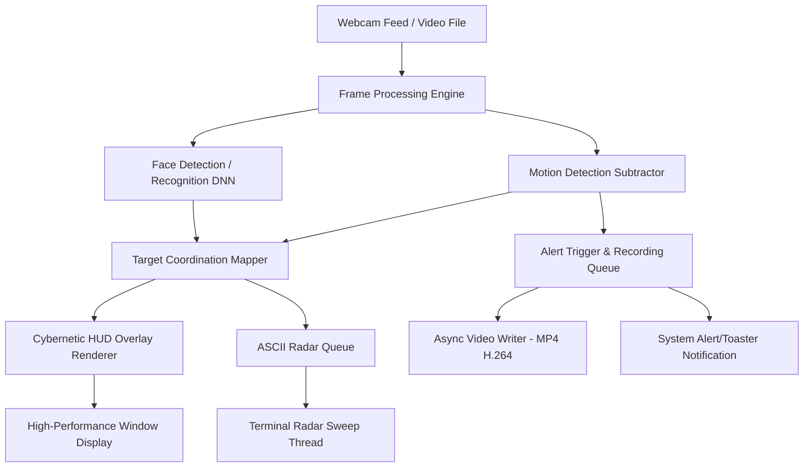

# Implementation Plan - Project: Cyber Sentinel (Edge AI Monitor)

An advanced, edge-computing C++ security application that transforms a standard webcam feed into a cybernetic target acquisition display, with real-time motion detection, neural-network-based biometric face recognition (Friend/Foe), and a terminal-based ASCII sonar radar.

## Architectural Overview

The application will run on a multi-threaded architecture to ensure real-time performance (30+ FPS) on standard PC hardware:
1. **Thread 1: Main Feed & CV Pipeline**: Captures video frames, runs background subtraction for motion detection, executes DNN-based face detection/recognition, renders the cybernetic HUD, and manages window display.
2. **Thread 2: Sonar Radar Console**: Computes and prints a sweeping 2D ASCII radar screen in the command terminal, mapping detected targets from the camera field of view.
3. **Thread 3: Alert & Recording Engine**: Handles file writes (asynchronously writing H.264 MP4 threat video clips) and fires system alerts without blocking the video capture loop.

---

## Technical Specifications & Dependencies

### Build Environment
*   **Operating System**: Windows
*   **Compiler**: Microsoft Visual C++ Compiler (MSVC 2019 Build Tools, C++17)
*   **Build System**: CMake (via MSVC build toolchain)
*   **Primary Library**: OpenCV 4.9.0 (Prebuilt Windows package, downloaded and linked via CMake)
*   **Deep Learning Models**: OpenCV DNN loading pre-trained ONNX models:
    *   **Face Detection**: YuNet (ultra-fast edge face detector)
    *   **Face Recognition**: ArcFace / MobileFaceNet (for generating facial embeddings)

---

## Proposed Changes & Files

We will initialize a new CMake C++ project in a subdirectory under the scratch path:
`C:/Users/mejba/.gemini/antigravity/scratch/cyber_sentinel/`

### Project Files

#### [NEW] [CMakeLists.txt](file:///C:/Users/mejba/.gemini/antigravity/scratch/cyber_sentinel/CMakeLists.txt)
Defines project build configurations, links OpenCV libraries, and specifies include headers.

#### [NEW] [src/main.cpp](file:///C:/Users/mejba/.gemini/antigravity/scratch/cyber_sentinel/src/main.cpp)
Main application entry point. Handles program initialization, OpenCV window creation, thread synchronization, and the main video capture loop.

#### [NEW] [src/detector.hpp](file:///C:/Users/mejba/.gemini/antigravity/scratch/cyber_sentinel/src/detector.hpp) & [src/detector.cpp](file:///C:/Users/mejba/.gemini/antigravity/scratch/cyber_sentinel/src/detector.cpp)
Contains the `MotionDetector` class (handles background subtraction, thresholding, noise filtering, contour grouping) and the `BiometricClassifier` class (loads DNN models, computes facial embeddings, and calculates L2 distance thresholds for friend-or-foe recognition).

#### [NEW] [src/hud.hpp](file:///C:/Users/mejba/.gemini/antigravity/scratch/cyber_sentinel/src/hud.hpp) & [src/hud.cpp](file:///C:/Users/mejba/.gemini/antigravity/scratch/cyber_sentinel/src/hud.cpp)
Implements drawing routines to overlay neon UI grids, scanning lines, lock-on target boxes, and sliding system stats directly onto video frames.

#### [NEW] [src/radar.hpp](file:///C:/Users/mejba/.gemini/antigravity/scratch/cyber_sentinel/src/radar.hpp) & [src/radar.cpp](file:///C:/Users/mejba/.gemini/antigravity/scratch/cyber_sentinel/src/radar.cpp)
Runs the console-based 2D sonar grid thread, printing sweeping lines, degree metrics, and lingering dots representing target positions.

#### [NEW] [src/alert.hpp](file:///C:/Users/mejba/.gemini/antigravity/scratch/cyber_sentinel/src/alert.hpp) & [src/alert.cpp](file:///C:/Users/mejba/.gemini/antigravity/scratch/cyber_sentinel/src/alert.cpp)
Manages saving H.264 video clips of security violations and triggering Windows notification bubbles.

#### [NEW] [run.bat](file:///C:/Users/mejba/.gemini/antigravity/scratch/cyber_sentinel/run.bat)
A quick-compile-and-run shell script that downloads OpenCV 4.9.0, configures CMake, builds the executable using MSBuild, and executes the system.

---

## Detailed Component Design

### 1. Cybernetic HUD (Terminator-Style UI)
*   **Target Lock reticles**: Draws bracket corners around objects that dynamically scale. If target threat increases, color shifts from cyan to warning red.
*   **Scanning Text overlay**: Scrolling telemetry on the side of the window displaying camera feed diagnostics (resolution, FPS, RAM utilization, threat index).
*   **Grid layout**: A subtle coordinate grid with horizontal crosshairs center-aligned on screen.

### 2. Biometric Face Classifier (Friend/Foe DNN)
*   **Face Detection**: Uses OpenCV DNN with YuNet, which processes an image in a few milliseconds on standard CPU.
*   **Face Recognition**: ArcFace ONNX model maps faces to a 128-dimensional vector space.
*   **Database**: A simple local directory containing face images of authorized users (e.g. `database/mejba.jpg`). On startup, these images are loaded, mapped to vectors, and cached.
*   **Inference**: When a face is detected in the video stream, its embedding vector is compared against the database using Euclidean (L2) distance. If the distance is below the threshold, it identifies the user as `FRIEND: [Name]`. If not, it marks them as `UNAUTHORIZED FOE`.

### 3. Sonar Radar Terminal UI
*   We will use standard Windows Console control commands to manipulate the cursor position without clearing the screen, preventing terminal flicker.
*   The radar draws a circular sweep line using coordinates. Targets are mapped using camera contour centers relative to screen coordinates.
*   It displays tracking dots that fade in intensity as the sweep rotates past them.

---

## Verification Plan

### Automated Build Verification
*   Compile testing via `run.bat` using MSBuild to ensure error-free compilation.
*   Verify CMake locates the downloaded prebuilt OpenCV installation.

### Manual Verification
1.  **Webcam Test**: Run the executable to verify the camera starts and streams video.
2.  **HUD Verification**: Wave hand in front of the camera and verify:
    *   Neon bounding boxes acquire and track the hand.
    *   Velocity lines stretch in the direction of motion.
3.  **Biometrics Verification**:
    *   Point the camera at an authorized face (registered in `database/`) and check if the HUD highlights in green with the name.
    *   Point at an unknown face (or photo) and check if the HUD flashes red with `UNAUTHORIZED FOE` alerts.
4.  **Radar Sweep**: Check the command prompt window to verify the sonar radar sweeps smoothly at 30+ updates per second, highlighting blips.
5.  **Recording Test**: Trigger a "Foe" alert and verify a `.mp4` file is generated inside the project folder and plays back correctly.
